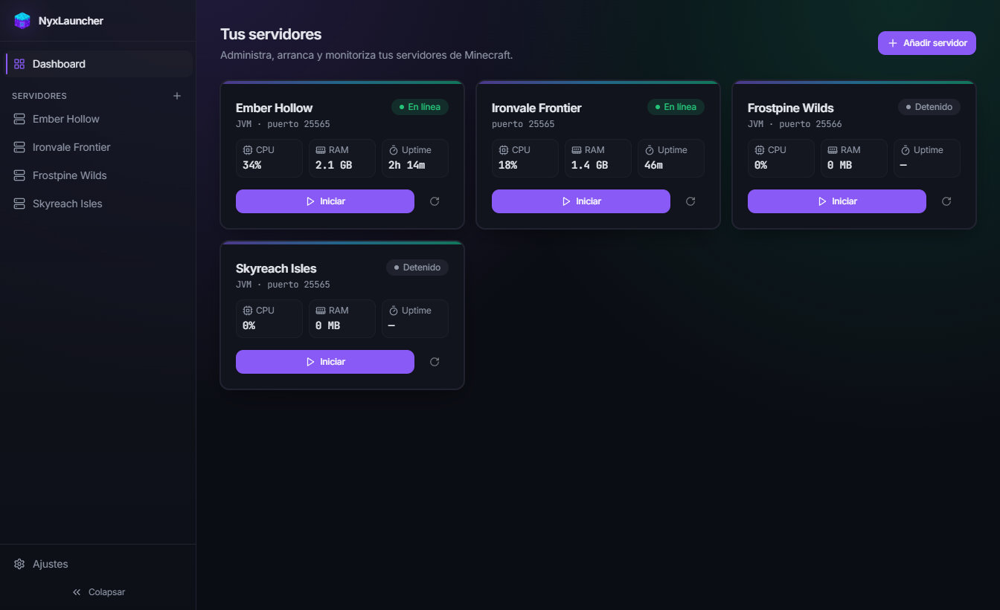
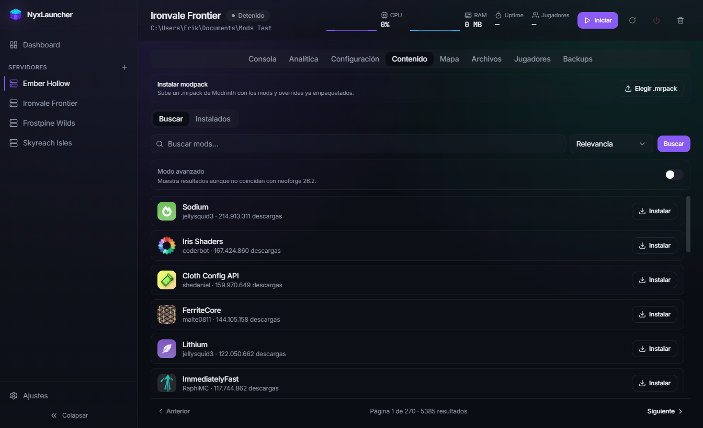

<div align="center">


# NyxLauncher

**Gestiona todos tus servidores de Minecraft desde una sola app de escritorio.**

Arranca, monitoriza, mapea y configura Paper, Purpur, Folia, Fabric, Forge, NeoForge,
vanilla y proxies como Velocity — sin tocar una terminal.

[](https://github.com/LastWardMZ/nyxlauncher/releases/latest)
[](https://github.com/LastWardMZ/nyxlauncher/releases/latest)
[](https://www.electronjs.org/)

[Descargar última versión](https://github.com/LastWardMZ/nyxlauncher/releases/latest) · [Reportar un problema](https://github.com/LastWardMZ/nyxlauncher/issues)

</div>

<br />



<br />

## ¿Qué es NyxLauncher?

NyxLauncher es un launcher de escritorio para gente que administra servidores de
Minecraft y está cansada de hacerlo todo desde la línea de comandos. Descarga el
software del servidor, lo arranca con la consola integrada, te deja instalar mods
y plugins con dos clics, y hasta te renderiza un mapa 3D navegable del mundo — todo
sin salir de la app.

## Funciones

- 🖥️ **Multiservidor** — administra cuantos servidores quieras desde un único dashboard, con estado, CPU, RAM y uptime en vivo.
- ⚙️ **Cualquier tipo de servidor** — Paper, Purpur, Folia, Fabric, Forge, NeoForge, vanilla y proxies (Velocity). Importa servidores existentes desde un `.zip`.
- 📦 **Gestor de contenido** — busca, instala, actualiza y desinstala plugins y mods directamente desde Modrinth, con vista previa de cada proyecto.
- 🗺️ **Mapa interactivo** — genera un mapa 2D/3D navegable del mundo con BlueMap, integrado en la propia app. Funciona incluso en servidores vanilla.
- 📊 **Analítica en tiempo real** — gráficas de uso de CPU y RAM, y estadísticas de almacenamiento en disco.
- 🧩 **Consola integrada** — arranca, para y manda comandos sin abrir una ventana externa.
- 📁 **Explorador de archivos** — navega, edita y gestiona los ficheros del servidor desde la propia app.
- 👥 **Gestión de jugadores** — whitelist, ops y baneos desde una interfaz visual.
- 💾 **Copias de seguridad automáticas** — backups programados por servidor.
- 🔄 **Auto-actualización** — la app se mantiene al día sola.

## Capturas

<table>
<tr>
<td width="50%">

**Gestor de contenido** — instala mods y plugins desde Modrinth sin salir de la app.



</td>
<td width="50%">

**Analítica** — CPU, RAM y uso de disco de cada servidor en tiempo real.


</td>
</tr>
</table>

## Descarga

Última versión para Windows disponible en la
[página de releases](https://github.com/LastWardMZ/nyxlauncher/releases/latest).

## Desarrollo

```bash
npm install
npm run dev
```

Compilar un instalador de Windows:

```bash
npm run build:win
```

## Stack

Electron · React · TypeScript · Vite · Tailwind CSS · Zustand
