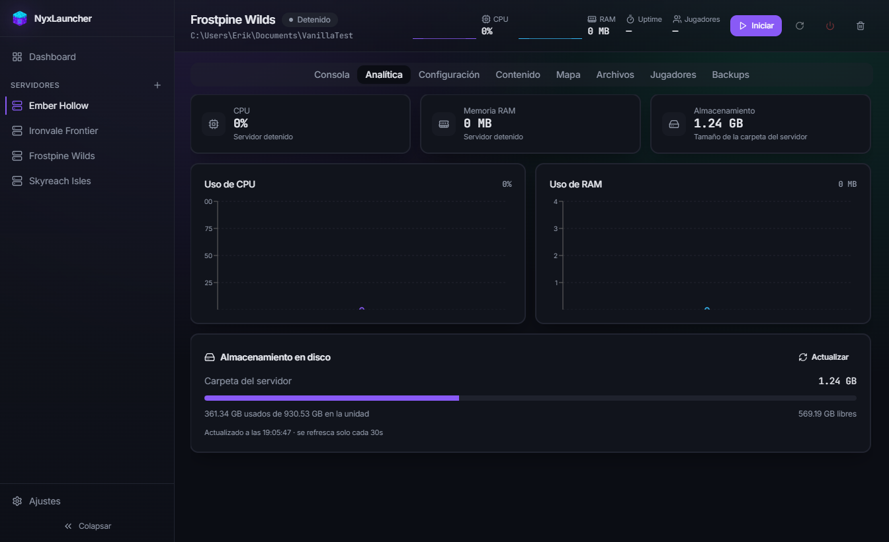

<div align="center">


# NyxLauncher

**Gestiona todos tus servidores de Minecraft desde una sola app de escritorio.**

Arranca, monitoriza, mapea y configura Paper, Purpur, Folia, Fabric, Forge, NeoForge,
vanilla y proxies como Velocity — sin tocar una terminal.

[](https://github.com/LastWardMZ/nyxlauncher/releases/latest)
[](https://github.com/LastWardMZ/nyxlauncher/releases/latest)
[](https://www.electronjs.org/)

[Descargar última versión](https://github.com/LastWardMZ/nyxlauncher/releases/latest) · [Reportar un problema](https://github.com/LastWardMZ/nyxlauncher/issues)

</div>

<br />


<br />

## ¿Qué es NyxLauncher?

NyxLauncher es un launcher de escritorio para gente que administra servidores de
Minecraft y está cansada de hacerlo todo desde la línea de comandos. Descarga el
software del servidor, lo arranca con la consola integrada, te deja instalar mods
y plugins con dos clics, y hasta te renderiza un mapa 3D navegable del mundo — todo
sin salir de la app.

## Funciones

- 🖥️ **Multiservidor** — administra cuantos servidores quieras desde un único dashboard, con estado, CPU, RAM y uptime en vivo.
- ⚙️ **Cualquier tipo de servidor** — Paper, Purpur, Folia, Fabric, Forge, NeoForge, vanilla y proxies (Velocity). Importa servidores existentes desde un `.zip`.
- 📦 **Gestor de contenido** — busca, instala, actualiza y desinstala plugins y mods directamente desde Modrinth, con vista previa de cada proyecto. Para servidores de mods, también puedes buscar e instalar modpacks completos ya armados por la comunidad.
- 🗺️ **Mapa interactivo** — genera un mapa 2D/3D navegable del mundo con BlueMap, integrado en la propia app. Funciona incluso en servidores vanilla.
- 📊 **Analítica en tiempo real** — gráficas de uso de CPU y RAM, y estadísticas de almacenamiento en disco.
- 🧩 **Consola integrada** — arranca, para y manda comandos sin abrir una ventana externa.
- 📁 **Explorador de archivos** — navega, edita y gestiona los ficheros del servidor desde la propia app.
- 👥 **Gestión de jugadores** — whitelist, ops y baneos desde una interfaz visual.
- 💾 **Copias de seguridad automáticas** — backups programados por servidor.
- 🌐 **Acceso remoto** — abre el panel completo desde el navegador: por tu red local, solo desde tus propios dispositivos (Tailscale), o públicamente por internet con dominio propio (Cloudflare), con 2FA, aprobación de dispositivos y avisos por email.
- 🔄 **Auto-actualización** — la app se mantiene al día sola.

## Capturas

<table>
<tr>
<td width="50%">

**Gestor de contenido** — instala mods y plugins desde Modrinth sin salir de la app.


</td>
<td width="50%">

**Analítica** — CPU, RAM y uso de disco de cada servidor en tiempo real.



</td>
</tr>
</table>

## Acceso remoto

NyxLauncher puede abrirse desde el navegador de otro dispositivo, no solo desde el propio
PC donde corre. Hay tres niveles, cada uno con más alcance que el anterior — puedes usar
uno solo o combinarlos. Todos están en **Ajustes → Acceso remoto**, y todos exigen crear
antes un usuario y una contraseña para el panel (se pide la primera vez que activas cualquiera
de ellos) — ambos hacen falta para entrar, no solo la contraseña.

### Red local (LAN)

El panel queda accesible desde cualquier dispositivo de tu propia WiFi/red — el móvil, otro
PC de casa, etc.

1. Ajustes → Acceso remoto → activa **"Permitir acceso desde la red local"**.
2. Elige un puerto (por defecto 8791) y pulsa **Aplicar puerto**.
3. Te aparece la URL (`http://<tu-ip-local>:puerto`) con un código QR para escanear desde
   el móvil.

Sigue pidiendo el usuario y la contraseña del panel para entrar — cualquiera en tu WiFi puede
*llegar* a la pantalla de login, pero no entrar sin ellos.

### Solo mis dispositivos (Tailscale)

Crea una red privada entre tus propios dispositivos — el panel no expone ningún puerto a
internet, solo es alcanzable dentro de esa red.

1. Selector **"Acceso por internet"** → elige **"Solo mis dispositivos (Tailscale)"**.
2. Pulsa **Instalar Tailscale**. Windows pedirá una confirmación de administrador — es
   normal, hace falta para instalar el servicio, y solo se pide esta vez.
3. Pulsa **Conectar**. Se abre un enlace (o escanea el QR desde el móvil) para iniciar
   sesión con tu cuenta de Tailscale (es gratis, admite cuenta de Google/GitHub/Microsoft).
4. Una vez aprobado, verás el hostname `algo.tu-red.ts.net` — esa es la URL, accesible solo
   desde dispositivos dados de alta en tu misma cuenta de Tailscale.

### Acceso público (internet, vía Cloudflare)

Para poder entrar desde cualquier sitio, no solo desde tus dispositivos. Es el nivel de
mayor exposición, así que **exige activar la verificación en dos pasos (2FA) primero** —
el selector no deja elegir este perfil hasta que la configures.

<details>
<summary><strong>1. Activa la verificación en dos pasos (2FA)</strong></summary>
<br>

En la sección **"Verificación en dos pasos (2FA)"** de Ajustes, pulsa **Activar 2FA**. Sale
un código QR — escanéalo con Google Authenticator, Authy, o cualquier app de códigos TOTP
(o copia el código manual que aparece debajo si no puedes escanear). Introduce el código de
6 dígitos que te genere la app para confirmar.

</details>

<details>
<summary><strong>2. Elige cómo quieres exponer el panel</strong></summary>
<br>

Con el selector en **"Acceso público"**, tienes tres formas de conectar el túnel de
Cloudflare (necesita instalarse una vez, botón **Instalar cloudflared** — sin UAC, es un
binario portátil):

**Sin dominio propio (la más simple):** pulsa **Activar túnel rápido**. En segundos tienes
una URL pública tipo `https://algo-random.trycloudflare.com`, gratis y sin necesidad de
cuenta de Cloudflare. Eso sí, esa URL cambia cada vez que reconectas.

**Con un dominio que ya tienes en Cloudflare:** necesitas un token de API de Cloudflare.
Para crearlo:
1. Entra en el [dashboard de Cloudflare](https://dash.cloudflare.com/profile/api-tokens) →
   **API Tokens** → **Create Token** → **Create Custom Token**.
2. Dale estos permisos: **Zone → DNS → Edit**, **Account → Cloudflare Tunnel → Edit**, y
   **Zone → Zone → Read**.
3. En "Zone Resources" limita el token a la zona (dominio) que vas a usar, no a todas.
4. Copia el token generado, escribe tu subdominio (ej. `panel.tudominio.com`) y pega el
   token en NyxLauncher → **Activar**. El registro DNS y el túnel se crean solos.

**Con un dominio que no está en Cloudflare:** marca la casilla "Mi dominio no está en
Cloudflare". Apunta un registro **A** de tu dominio a la IP pública de tu conexión y abre
el puerto correspondiente en tu router; pulsa **Comprobar DNS** hasta que confirme que
resuelve, y **Activar** — NyxLauncher instala [Caddy](https://caddyserver.com/) y gestiona
el certificado HTTPS (Let's Encrypt) automáticamente.

</details>

<details>
<summary><strong>3. Capas de seguridad adicionales (opcionales, muy recomendadas)</strong></summary>
<br>

- **Lista blanca de IPs** — restringe el login a IPs/rangos concretos (formato CIDR, ej.
  `85.84.12.0/24`). Vacío = cualquier IP puede intentar el login (sigue protegido por
  usuario + contraseña + 2FA).
- **Dispositivos de confianza** — la primera vez que entras desde un navegador nuevo con el
  perfil público activo, se queda "pendiente de aprobación" hasta que confirmes por el
  enlace que llega al email (necesita tener configurados los avisos por email, siguiente
  punto). Puedes revocar cualquier dispositivo desde Ajustes en cualquier momento.
- **Avisos por email** — te avisa de cada login nuevo y de cada dispositivo pendiente de
  aprobar, con un enlace de "no fui yo, revocar" en cada aviso. Usa la API de
  [Resend](https://resend.com):
  1. Crea una cuenta gratuita en [resend.com](https://resend.com) (el plan gratuito de
     Resend es más que suficiente para esto).
  2. En el dashboard, ve a **API Keys** → **Create API Key**, dale un nombre cualquiera y
     copia la clave (empieza por `re_`).
  3. En NyxLauncher, Ajustes → Acceso remoto → **Avisos por email**: escribe el email donde
     quieres recibir los avisos y pega la API key de Resend, **Guardar** en cada campo.
  4. No hace falta verificar tu propio dominio en Resend — los correos salen desde su
     dirección compartida de pruebas, que funciona sin configuración extra.
- **Bloqueo por intentos fallidos** — automático, no hay que configurar nada: tras varios
  intentos de contraseña fallidos seguidos desde la misma IP, se bloquea temporalmente con
  tiempos crecientes.
- **Registro de accesos** — cada intento de login (éxito, fallo o bloqueado) queda anotado
  en Ajustes, con fecha, IP y resultado.

</details>

## Descarga

Última versión para Windows disponible en la
[página de releases](https://github.com/LastWardMZ/nyxlauncher/releases/latest).

## Despliegue con Docker

Además del instalador de Windows, NyxLauncher se puede correr como contenedor en un VPS o
un NAS (Synology, Unraid...) — es una vía de despliegue **adicional**, el instalador de
Windows no cambia ni deja de funcionar por esto. En este modo no hay ventana de escritorio:
todo se gestiona desde el panel web (la misma interfaz que ya usa
[Acceso remoto](#acceso-remoto)), que en Docker siempre está accesible desde el arranque.

### Inicio rápido — VPS Linux (modo `host`, recomendado)

```bash
git clone https://github.com/LastWardMZ/nyxlauncher.git
cd nyxlauncher
cp .env.example .env
docker compose up -d nyxlauncher
```

Abre `http://<ip-del-vps>:8791` y completa el formulario de "Configura el acceso remoto" la
primera vez. En este modo el contenedor comparte la red del propio host
(`network_mode: host`), así que cada servidor de Minecraft que crees queda accesible en su
puerto automáticamente, sin publicar cada uno a mano.

### Inicio rápido — NAS (Synology Container Manager / Unraid Community Apps)

Ambos acaban usando el mismo `docker-compose.yml` — en Synology, Container Manager tiene un
apartado para importar un proyecto Compose directamente; en Unraid, la plantilla de Docker
Compose Manager (o el plugin Compose de la Community Apps) hace lo mismo. Sube el repo (o
solo `Dockerfile`/`docker-compose.yml`/`.env`) a una carpeta del NAS y apunta ahí. Si tu NAS
no soporta `network_mode: host` bien (poco común en Linux, pero puede pasar según el
Synology), usa el servicio `nyxlauncher-portrange` en su lugar (ver abajo).

### Los dos modos de red

- **`host`** (`docker compose up -d nyxlauncher`) — recomendado en cualquier VPS/NAS Linux.
  Sin `ports:` que mantener sincronizados; cada servidor de Minecraft usa su puerto tal cual,
  como si NyxLauncher corriera nativo en esa máquina.
- **`portrange`** (`docker compose --profile portrange up -d nyxlauncher-portrange`) — para
  Docker Desktop en Mac/Windows, donde `network_mode: host` no funciona igual. Publica el
  puerto del panel más un rango fijo (`NYXLAUNCHER_PORT_RANGE_START`/`_END` en `.env`,
  25500-25600 por defecto) — el launcher sugiere el siguiente puerto libre del rango al crear
  un servidor nuevo, pero lo puedes cambiar a mano igualmente.

### Variables de entorno (`.env`)

| Variable | Por defecto | Para qué |
|---|---|---|
| `NYXLAUNCHER_PANEL_PORT` | `8791` | Puerto del panel web |
| `NYXLAUNCHER_PORT_RANGE_START` / `_END` | `25500` / `25600` | Solo en modo `portrange` |
| `NYXLAUNCHER_SECRET_KEY` | *(vacío → autogenerada)* | Clave de cifrado de los secretos (contraseña, TOTP, tokens) — déjalo vacío la primera vez, se genera sola y se guarda en el volumen de datos |
| `NYXLAUNCHER_ADMIN_USERNAME` / `_PASSWORD` | *(vacío)* | Crea la cuenta admin (usuario + contraseña) sin pasar por el formulario web — opcional, solo si faltara una cuenta |
| `TS_AUTHKEY` | *(vacío)* | Solo si usas el sidecar de Tailscale en modo `portrange` |

### Volúmenes

| Carpeta del host | Dentro del contenedor | Contenido |
|---|---|---|
| `./nyxlauncher-data` | `/data` | Configuración, clave de cifrado, backups |
| `./nyxlauncher-servers` | `/data/servers` | Cada servidor de Minecraft (mundo, plugins/mods, config) — el mapa de BlueMap ya queda anidado dentro, no hace falta un volumen aparte |

### Acceso remoto (Tailscale/Cloudflare) desde Docker

- **Tailscale ("Solo mis dispositivos")**: en modo `host`, instala Tailscale en el propio
  host (no en el contenedor) — Synology lo tiene en Package Center, en un VPS es
  `curl -fsSL https://tailscale.com/install.sh | sh` — y descomenta la línea del socket en
  `docker-compose.yml` para que el contenedor pueda consultar su estado. En modo
  `portrange`, usa el servicio `tailscale` (sidecar oficial) ya incluido comentado en el
  compose, con tu `TS_AUTHKEY` en `.env`.
- **Cloudflare / dominio propio**: `cloudflared` y `caddy` ya vienen empaquetados dentro de
  la imagen — no hacen falta pasos extra, se activan igual que en el escritorio desde
  Ajustes → Acceso remoto.

### Actualizar

Por ahora la imagen se construye localmente desde el propio repo (`build: .` en el
compose), así que actualizar es:

```bash
git pull
docker compose up -d --build
```

NyxLauncher no se autoactualiza dentro de Docker (a diferencia del instalador de Windows,
que sí lo hace solo) — si prefieres automatizarlo, [Watchtower](https://containrrr.dev/watchtower/)
puede reconstruir/recrear el contenedor por ti en un cron.

## Desarrollo

```bash
npm install
npm run dev
```

Compilar un instalador de Windows:

```bash
npm run build:win
```

## Stack

Electron · React · TypeScript · Vite · Tailwind CSS · Zustand
